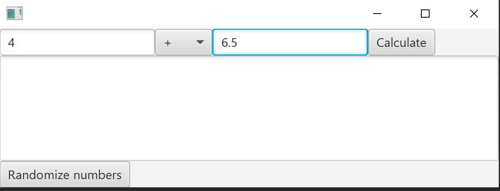

# Småoppgaver
I pakken *stuff* vil du finna ein del mindre oppgåver. Desse heng ikkje saman.
Dei tre deloppgåvene gir 10-15%, totalt 40% av eksamen.

## Oppgåve 1: Enkel klasseoppbygging og predikat 
I *stuff* finn du skalet til to klassar, Movie og MovieRegister. Les klasseskildringa under nøye.

[Movie](Movie.java) har følgjande interne tilstand *(her vil du ikkje finna noko skildring i javadocen)*:
- tittelen til filmen. Denne kan ikkje vera *null*, og skal kunna hentast ut med metoden *getTitle()*.
- kor mange gonger han er sett, skal kunna hentast ut med metoden *getTimesWatched()*. Blir auka med ein kvar gong ein har sett filmen, oppdatert med metoden *watch()*.
- kor god var filmen, heiltal frå 1-6. Alle filmar treng ikkje ha ein rating. Skal kunna hentast ut med metoden *getRating()*

Det er ikkje nødvendig å implementera fleire metodar enn dei som trengst for fylla krava gitt over. Main-metoden i Movie viser nokre døme på bruk av testar mot passande kode.

[MovieRegister](MovieRegister.java) inneheld ei samling med *Movie*-objekt. Følgjande metodar finst:
- *addMovie(Movie movie)*: Moglegheit til å legga til nytt *Movie*-objekt
- *filterMovies(Predicate pred)*: Returnera filmane som tilfredsstiller krava beskrive i predikatet pred.
- *findMovie(String title)*: Returnera filmen med denne tittelen, eller *null* viss filmen ikkje finst.
- *watch(String title)*: Sjå filmen med denne tittelen. Aukar talet på gonger filmen er sett med 1. Viss tittelen ikkje finst i registeret skal metoden utløysa ein *IllegalStateException*.

## Oppgåve 2 - testing 
Klassen [AverageComputer](AverageComputer.java) lèt ein registrera mange heiltalsverdiar og berekna gjennomsnittet av dei. Det følgjer med ein testklasse, [AverageComputerTest](AverageComputerTest.java), som testar eit enkelt tilfelle (utrekning av snittet av tala 3, 4 og 5).

Tilsynelatande virke klassen fint, men han inneheld to feil, den eine knytt til utrekning av gjennomsnitt, den andre til innkapslingen. Ingen av desse blir fanga opp av testklassen. Oppgåva går ut på å forbetra testklassen slik at begge feila blir rapporterte på ein formålstenleg måte. Du kan endra den eksisterande testmetoden og evt. legga til nye.

## Oppgåve 3 - fxml 
Filen [Math.fxml](Math.fxml) definerer eit grensesnitt der brukaren skal kunna:
- skriva inn to flyttal i to tekstfelt
- velja ein rekningsmetode frå ein nedtrekkmeny (pluss, minus, gonge, dela) 
- trykka på ein knapp som så bereknar resultatet av reknestykket og skriv svaret inn i eit felt
- trykka på ein annan knapp som legg inn tilfeldige heiltal mellom 1 og 100 i begge tekstfelta

Du skal gjera utvidingar og endringar i fila *MathController.java* som gjer at krava nemnt over blir oppfylte. Er alle metodar som må finnast allereie definert? Grensesnittet kan sjåast ved å køyra fila *MathApp.java*. 

Slik ser FXML-applikasjonen ut:

