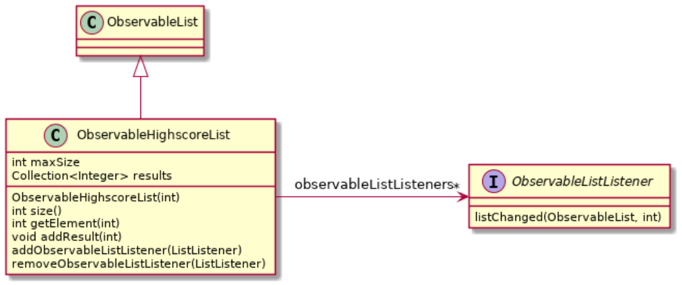
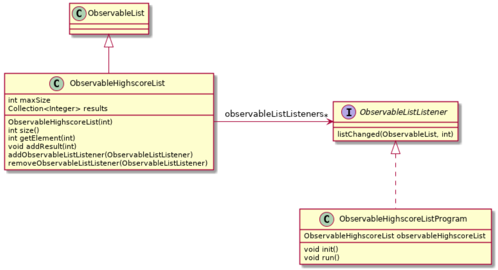
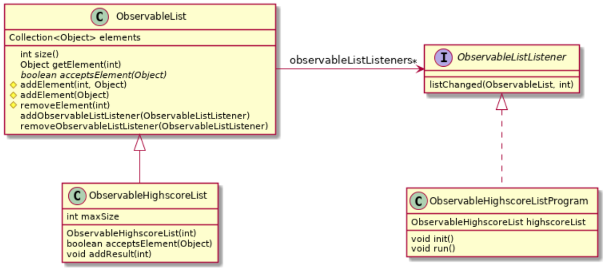

# Observatør-observert-teknikken og arv - HighscoreList-oppgave med ObservableList

Denne oppgaven handler om å bruke observatør-observert-teknikken for å bli
informert om endringer i en highscore-liste. Vi bruker også arv for å skille
ut gjenbrukbar kode for en generell, observerbar liste.

Observatør-observert-teknikken går ut på at det observerte objektet sier ifra
til en eller flere observatører om at tilstanden er endret. I denne oppgaven
skal vi lage en `HighscoreList` som kan si fra til lyttere av typen
`ListListener` når nye resultater blir registrert. En hovedprogramklasse kalt
`HighscoreProgram` vil bli brukt til å sjekke at det virker. Denne klassen
oppretter en `HighscoreList`-instans, legger inn resultater (tall) fra
konsollet som legges til lista og skriver ut lista hver gang et nytt resultat
faktisk blir lagt til.

Klassene skal legges i `src/main/java/oving7/` og tilhørende
tester ligger i `src/test/java/oving7/`.

### Del 1: Implementasjon av ObservableList og ObservableHighscoreList

En `ObservableHighscoreList` skal holde styr på heltallsresultater (av typen
int/Integer). Lista skal være _observerbar_ ved at den kan registrere lyttere
(`ObservableListListener`-instanser) og si fra til dem når lista blir endret.
Lista skal ha en maksimal lengde, som settes i _konstruktøren_, f.eks. skal en
topp 10-liste kunne opprettes med `new ObservableHighscoreList(10)`.
Nye resultater registreres med metoden `addResult(int)`, som skal finne riktig
posisjon og legge resultatet inn (dersom det er godt nok). Dersom lista er for
lang, så skal det dårligste resultatet fjernes. NB: _Lavest verdi er best_,
f.eks. antall sekunder på en oppgave eller antall flytt i Sokoban.

`ObservableListListener`-grensesnittet er vist i klassediagrammet nedenfor og
må implementers av alle klasser som ønsker å fungere som lyttere for
`ObservableHighscoreList`-instanser. Lyttere registrerer seg med
`ObservableHighscoreList` sin `addObservableListListener`-metode og vil siden
få beskjed om nye resultater ved at `listChanged`-metoden kalles. Argumentene
som tas inn er `ObservableHighscoreList`-objektet som ble endret og _posisjonen_
i lista der endringen skjedde.

Merk at første argument til `listChanged`-metoden er av typen `ObservableList`.
Dette er en abstrakt superklasse for `ObservableHighscoreList`, som først
brukes i del 3 og som da skal holde orden på lista. `ObservableList` vil ha en
del generelle metoder som `ObservableHighscoreList` arver og kan bruke. For å
kunne kjøre testene for `ObservableHighscoreList` allerede i del 1, så må
`ObservableList` være definert fra starten. Lag derfor en tom
`ObservableList`-klasse og bruk denne som superklasse for
`ObservableHighscoreList`.

Her er en oversikt over metoden som må implementeres:

- `ObservableHighscoreList(int maxSize)` - konstruktøren tar inn _maks antall_
  resultater som lista skal kunne holde. Denne verdien må brukes av `addResult`,
  slik at resultater som er for dårlige kastes.
- `size()` - returnerer antall elementer i lista, som altså aldri skal
  overstige maks-antallet
- `int getElement(int)` - returnerer resultatet i posisjonen angitt av
  argumentet
- `void addResult(int)` - registrere et nytt resultat, og dersom resultatet er
  godt nok til å komme med på lista, så legges det inn på riktig plass.
  Dersom lista blir for lang, så må dårligste resultat kastes. Alle registrerte
  lyttere må få beskjed om en evt. endring av lista, inkludert hvilken
  posisjon som ble endret.
- `addObservableListListener(ObservableListListener)` - registrerer en ny lytter
- `removeObservableListListener(ObservableListListener)` - fjerner en tidligere
  registrert lytter

Klassediagram for `HighscoreList`, `ListListener` og `ObservableList`:

Testkode for denne oppgaven finner du her: [oving7/ObservableHighscoreListTest.java](../../src/test/java/oving7/ObservableHighscoreListTest.java).

### Del 2: Hovedprogram ObservableHighscoreListProgram

Lag en hovedprogramklasse kalt `ObservableHighscoreListProgram`, som tester at
`ObservableHighscoreList`-klassen din virker som den skal. La den opprette en
`ObservableHighscoreList`-instans, lese inn tall fra konsollet (f.eks. med en
`Scanner` og `nextInt`-metoden) og legge disse inn i lista. Sørg for at
`ObservableHighscoreListProgram` implementerer
`ObservableListListener`-grensesnittet og registrerer seg som lytter på
`HighscoreList`-instansen. La lyttermetoden `listChanged` skrive ut informasjon
og resultatene i `HighscoreList`-instansen og posisjonsargumentet, slik at du
ser at alt virker som det skal.

Vi foreslår følgende metoder og oppførsel:

- `void init()` - oppretter en ny `ObservableHighscoreList` og registrerer seg
  selv (altså `ObservableHighscoreListProgram`-instansen) som lytter
- `void run()` - leser inn tall (resultater) fra konsollet og legger dem til i
  listen
- `void listChanged(ObservableList, int)` - observerer endringer i
  `ObservableHighscoreList`-instansen og skriver ut posisjonsargumentet, samt
  selve listen, til konsollet

Klassediagrammet viser hvordan klassene henger sammen, og vårt forslag til
metoder:

### Del 3: ObservableList

Den abstrakte superklassen `ObservableList` skal legges til som en generell
superklasse for observerbare lister, som `ObservableHighscoreList` skal arve
fra. Denne klassen skal både holde en liste med objekter (`Object`) og håndtere
registrering av lyttere, altså en liste med `ObservableListListener`-instanse,
som får beskjed om endringer i lista (slik at lista dermed er _observerbar_).
Dette betyr at `ObservableList` overtar håndtering av både resultater og
lyttere fra `ObservableHighscoreList`-klassen. For å gjøre `ObservableList` mer
generell og gjenbrukbar, så lar vi den håndtere `Object`-instanser (heller enn
`Integer`). Samtidig deklarerer den en _abstrakt_ metode `acceptsElement`, som
subklasser må _redefinere_ for å bestemme hva slags objekter det skal være lov
å legge inn. `ObservableHighscoreList` vil f.eks måtte redefinere den slik
at bare `Integer`-objekter aksepteres.

`ObservableList` skal ha følgende metoder (noen er altså overtatt fra
`ObservableHighscoreList`):

- `int size()` - returnerer antall elementer i lista
- `Object getElement(int)` - returnerer elementet i posisjonen angitt av
  argumentet
- `abstract boolean acceptsElement(Object)` - returnerer hvorvidt _subklassen_
  aksepterer at objektet legges inn i lista (f.eks. aksepterer `HighscoreList`
  kun `Integer`-objekter).
- `void addElement(int, Object)` - legger til et element på posisjonen angitt
  av argumentet, men bare dersom det _aksepteres_ som element. Dersom elementet
  ikke aksepteres, så skal `IllegalArgumentException` utløses. Dersom posisjonen
  er ulovlig så skal `IndexOutOfBoundsException` utløses.
- `void addElement(Object)` - legger til et element bakerst i lista, men bare
  dersom det _aksepteres_ som element. Dersom elementet ikke aksepteres, så skal
  `IllegalArgumentException` utløses.
- `void removeElement(int)` - fjerner elementet på posisjonen angitt av
  argumentet. Dersom posisjonen er ulovlig så skal `IndexOutOfBoundsException`
  utløses.

`ObservableHighscoreList` skal endres slik at den i størst mulig grad bruker
metodene som arves fra `ObservableList`, men forøvrig ikke endrer oppførsel.
Kjør hovedprogramklassen `ObservableHighscoreListProgram` for å sjekke at dette
faktisk stemmer.

Klassediagrammet viser hvordan klassene henger sammen, og hvor metodene nå er
deklarert/implementert. Merk at `addElement`- og `removeElement`-metodene er
angitt som `protected` (ruter-symbolet), slik at kun subklasser skal kunne
bruke dem.

Testkode for denne oppgaven finner du her: [oving7/ObservableListTest.java](../../src/test/java/oving7/ObservableListTest.java).
