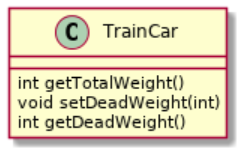
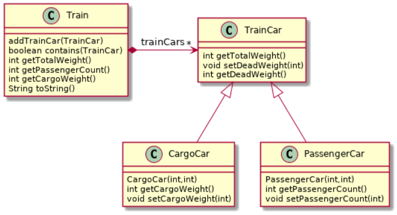

# Arv - Train-oppgave

I denne oppgaven skal vi modellere to typer togvogner og bruke dem i et tog. Vi vil bruke
arv og samle det som er felles for togvognene i en _superklasse_.

### Del 1 - TrainCar

I denne delen skal du lage en klasse kalt `TrainCar` for en enkel og generell
togvogn, med følgende funksjonalitet (se også diagrammet over):

- `TrainCar(int)` - en konstruktør som tar inn hvor mye en tom vogn veier.
- `int getTotalWeight` - returnerer vognas totale vekt. Merk at denne også skal
  kunne kalles på _subklasser_ og fortsatt returnere totalvekta til vogna
  (stikkord: _redefinering_).
- `setDeadWeight(int)` - setter hvor mye en tom vogn veier. Altså vekten til
  kun vognen, uten passasjerer eller last.
- `int getDeadWeight()` - returnerer hvor mye en tom vogn veier. Altså vekten til
  kun vognen, uten passasjerer eller last.

Testkode for oppgaven finner du her: [oving7/TrainCarTest.java](../../src/test/java/oving7/TrainCarTest.java).

### Del 2 - CargoCar og PassengerCar

I denne delen skal du lage to forskjellige typer togvogner som er spesialiserte
for sitt bruk. Begge skal arve fra `TrainCar`.

##### CargoCar extends TrainCar:

Denne klassen skal gjenspeile en lastevogn som frakter diverse ting og tang.
Følgende funksjonalitet trengs (se også diagrammet over):

- `CargoCar(int, int)` - her tas inn hvor mye en tom vogn veier (som i `TrainCar`),
  og hvor mye vogna sin last veier.
- `int getCargoWeight()` - returnerer hvor mye lasten veier.
- `setCargoWeight(int)` - setter en ny verdi for vekten til lasten.

##### PassengerCar extends TrainCar:

Denne klassen gjenspeiler en passasjervogn. Legg til følgende metoder
(se også diagrammet over):

- `PassengerCar(int, int)` - her tas inn hvor mye en tom vogn veier
  (som i `TrainCar`), og hvor mange passasjerer det er i vogna.
- `int getPassengerCount()` - returner antall passasjerer.
- `setPassengerCount(int)` - setter en ny verdi for antall passasjerer.

For å beregne totalvekta, så kan du anta at en gjennomsnittspassasjer veier 80 kg.

Testkode for oppgavene finner du her: [oving7/PassengerCarTest.java](../../src/test/java/oving7/PassengerCarTest.java) og [oving7/CargoCarTest.java](../../src/test/java/oving7/CargoCarTest.java).

### Del 3 - Train

Klassen `Train` skal forestille et tog bestående av et sett vogner.
Klassen skal ha følgende metoder (se også diagrammet over):

- `addTrainCar(TrainCar)` - denne metoden skal ta inn en togvogn og knytte den
  til dette lokomotivet.
- `boolean contains(TrainCar)` - Sjekker om lokomotivet har `TrainCar`-argument
  knyttet til seg.
- `int getTotalWeight()` - returner alle vognene sin totale vekt. Vi tar ikke
  høyde for lokomotivet sin eventuelle vekt.
- `int getPassengerCount()` - tilsvarende `PassengerCar` sin metode, men
  returnerer antallet for alle vognene.
- `int getCargoWeight()` - tilsvarende `CargoCar` sin metode, men returnerer
  lastevekten for alle vognene.
- `String toString()` - `toString`-metoden skal sette sammen en _String_ med
  oversikt over alle vognene som er knyttet til den. For hver vogn skal vogntype
  og totalvekt være med. Passasjervogner skal i tillegg ha med antall passasjerer
  og lastevogner skal ha med hvor mye lasten veier.

Testkode for oppgaven finner du her: [oving7
/TrainTest.java](../../src/test/java/oving7/TrainTest.java).
